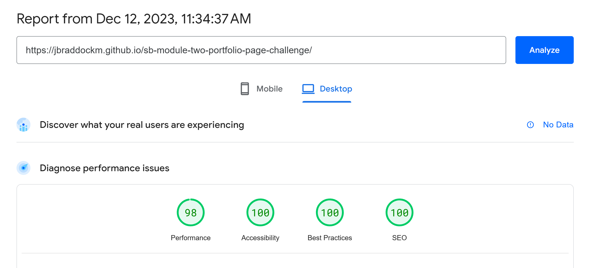

# Skills Bootcamp Module 2 - Portfolio Page Challenge

## Description

This project focuses on creating a responsive portfolio page. The primary objectives include:

* **Mockup Functionality**: The page should faithfully translate the application's functionality.
* **Mobile First Responsive Design**: The page should adapt to various screens and devices.
* **Single Page Navigation**: The navigation links smoothly scroll to their respective sections within the page.
* **Your Work Showcase**: Present a section displaying titled images of your deployed web applications.
* **Featured Work Highlight**: The primary web application image should stand out as a featured work, displayed in a larger size.
* **Interactive Elements**: Ensure that page elements dynamically respond to user interactions, including clicks, hovers, scaling, and smooth transitions.
## Mockup Image

The provided mockup image illustrates the appearance and functionality of the web application.

## Table of Contents
* [Installation](#installation)
* [Usage](#usage)
* [Features](#features)
* [Credits](#credits)
* [License](#license)
## Installation
N/A
## Usage
* The application is deployed [here](https://jbraddockm.github.io/sb-module-two-portfolio-page-challenge/).
* test the application's compliance with accessibility standards, use [Google Pagespeed](https://pagespeed.web.dev/) or any other accessibility extension such as [WAVE](https://wave.webaim.org/).
* To test the application's adherence to SEO best practices, use [Google Pagespeed](https://pagespeed.web.dev/).
* To change colors, font or other properties, change css variables in [global.css](assets/css/01-settings/global.css).

## Features
The application has the following features and best practices implemented.

A custom caching solution is not possible to set in GitHub pages, and using Google Font affects performance, hence the Performance score 98.
The app has the same score in mobile, except for performance, which is 89 due to Google Font usage.

**HTML**
* Semantic HTML elements
* Images have appropriate alt texts
* Images have srcset attribute for serving images efficiently
* Headings hierarchy

**Responsiveness**
* Mobile-first design
* Fluid typography with CSS clamp
* Image srcset for better performance and efficiency

**Interactivity**
* Uses text-underline with text-underline-offset for hover effect
* Uses box-shadow and transition in portfolio section to highlight hover effect
* Uses smooth scrolling by default for all scrollable movements.

**CSS**
* Nested CSS syntax (Avoids using the latest syntax and features due to browser compatibility).
* CSS partials and categorisations
* Sample use of utility classes
* Reusable CSS classes
* Easy to refactor and modify
* Avoids duplications

**Accessibility**
* Semantic HTML
* Use of tabindex=0 where appropriate
* Proper colour contrast
* Succinct image alt texts
* Use of role tag where appropriate
* Use of title tag where appropriate

**SEO**
* Metadata: meta-description
* Metadata: rel="canonical"
* Metadata: Open Graph
* Metadata: robots
* Metadata: viewports
* Non-blocking elements or contents
* Optimised and properly resized images
* Image width and height attributes
* Image srcset

## Credits
* CSS organisation and naming convention is inspired by https://themes.trac.wordpress.org/browser/twentytwentyone/2.0/assets/sass.
* Fluid typography with CSS clamp was generated by https://www.fluid-type-scale.com/.
* Font is [Inter](https://fonts.google.com/specimen/Inter) from Google Fonts.
* Colours was generated by [Coolors](https://coolors.co/fffcf2-ccc5b9-403d39-252422-eb5e28).
## License
Please refer to the LICENSE in the repo.

